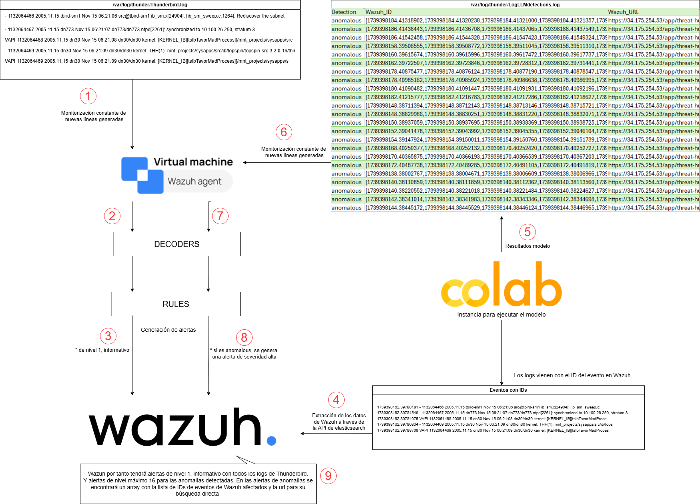
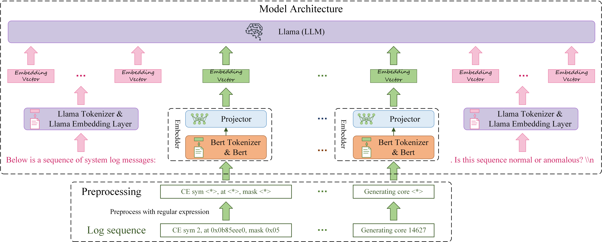

# LogLLM-Wazuh: Log-based Anomaly Detection On Wazuh Using Large Language Models #

La arquitectura de la solución es la siguiente.


El modelo original y su estudio "[LogLLM](https://github.com/guanwei49/LogLLM): Log-based Anomaly Detection Using Large Language Models" tienen la siguiente estructura.


## Install Wazuh

Para instalar el SIEM Wazuh en una sola instancia se seguirá el [Quickstart oficial](https://documentation.wazuh.com/current/quickstart.html)

```bash
curl -sO https://packages.wazuh.com/4.11/wazuh-install.sh && sudo bash ./wazuh-install.sh -a
sed -i "s/^deb /#deb /" /etc/apt/sources.list.d/wazuh.list
apt update
```

Acceder al dashboard de Wazuh a través de https://<WAZUH_DASHBOARD_IP_ADDRESS> y con los credenciales:

Username: admin

Password: <ADMIN_PASSWORD>

Si no se recuerdan los credenciales, ejecutar:

```bash
sudo tar -O -xvf wazuh-install-files.tar wazuh-install-files/wazuh-passwords.txt
```
### Agente de Wazuh

Para instalar el agente en otra instancia, en el dashboard principal, en el menú de la izquierda, si se selecciona "Agents management" > "Summary" se abrirá la ventana de endpoints, en dónde se mostrarán los ya desplegados y su estado, y desde dónde se podrán desplegar nuevos agentes, en el botón "Deploy new agent"

Por ejemplo, para desplegar un agente en Ubuntu 22.04 se ejecutaron los siguientes comandos, indicando la IP del manager de Wazuh:

```bash
wget https://packages.wazuh.com/4.x/apt/pool/main/w/wazuh-agent/wazuh-agent\_4.10.1-1\_amd64.deb && sudo WAZUH\_MANAGER='X.X.X.X' dpkg -i ./wazuh-agent\_4.10.1-1\_amd64.deb
sudo systemctl daemon-reload
sudo systemctl enable wazuh-agent
sudo systemctl start wazuh-agent
```

## Descarga y envío de logs.

Para descargar los logs de Thunderbird y enviarlos a Wazuh como si los generase el agente, se ejecutará:

```bash
sudo wget -O Thunderbird.tar.gz https://zenodo.org/records/8196385/files/Thunderbird.tar.gz?download=1
tar -xzvf Thunderbird.tar.gz
sudo python3 enviar_logs.py
```

Este script lo que hace es cargar línea a línea los logs en un fichero monitorizado por el agente. Para ver los logs en Wazuh se debe crear un decoder y una regla presonalizados.

## Obtener eventos de Wazuh para ser analizados.

Para obtener los eventos de Wazuh en las últimas 24 horas con su ID y el log de Thunderbird, se ejecuta:

```bash
sudo python3 recoger_eventos.py
```

## Analizar eventos

Una vez descargados los eventos de Wazuh, se puede ejecutar el modelo para analizarlos. Ejecutando este script, se generará un resultado indicando para cada subconjunto de logs si se ha detectado una anomalía en ellos o no, una lista de los IDs de los eventos analizados y una URL que lleva a la búsqueda directa de estos mismos.

```bash
sudo python3 analizar_eventos_wazuh.py
```

Un ejemplo con los resultados es detections.csv, estos se enviarán a Wazuh mediante el monitoreo de un archivo. Con la creación de decoders y reglas se podrán ver los resultados en el dashboard de Wazuh.

## Ajuste de parámetros

Para simular el ajuste de parámetros explicado en la memoria se emplean los archivos estudio_batch.py para estudiar el batch_size óptimo y estudio_windowstep.py para estudiar los parámetros window_size y step_size óptimos.

## Google Colab

Para ejecutar el modelo Google Colab es una buena opción ya que ofrece recursos computacionales de forma gratuíta.

## Probar el funcionamiento del modelo

Estos son los pasos que se ofrecen en el modelo original para probar su correcto funcionamiento y calcular las métricas.aaa

1. Create conda environment.

```
 conda install --yes --file requirements.txt # You may need to downgrade the torch using pip to match the CUDA version
```

2. Download open-source LLM [Meta-Llama-3-8B](https://huggingface.co/meta-llama/Meta-Llama-3-8B/tree/main), and
   Bert [bert-base-uncased](https://huggingface.co/google-bert/bert-base-uncased).

```
   ├── Meta-Llama-3-8B
   │ ├── config.json
   │ ├── generation_config.json
   │ ├── LICENSE
   │ ├── model-00001-of-00004.safetensors
   │ ├── model-00002-of-00004.safetensors
   │ ├── model-00003-of-00004.safetensors
   │ ├── model-00004-of-00004.safetensors
   │ ├── model.safetensors.index.json
   │ ├── special_tokens_map.json
   │ ├── tokenizer.json
   │ └── tokenizer_config.json
```

```
   ├── bert-base-uncased
   │ ├── config.json
   │ ├── model.safetensors
   │ ├── tokenizer.json
   │ ├── tokenizer_config.json
   │ └── vocab.txt
```

3. Prepare training and testing data

- Download BGL/HDFS_v1/Thunderbird dataset from [here](https://github.com/logpai/loghub). Download Liberty dataset
  from [here](http://0b4af6cdc2f0c5998459-c0245c5c937c5dedcca3f1764ecc9b2f.r43.cf2.rackcdn.com/hpc4/liberty2.gz).
- For **BGL**, **Thunderbird** and **Liberty**, set the following variations in **sliding_window.py** under *
  *prepareData**
  directory:
   ```
   data_dir =  # i.e. r'/mnt/public/gw/SyslogData/BGL'
   log_name =  # i.e. 'BGL.log'
   ```
  
  For  **Liberty**, you should activate
  ```
  start_line = 40000000
  end_line = 45000000
  ```
  
  For  **Thunderbird**, you should activate
  ```
  start_line = 160000000
  end_line = 170000000
  ```
  
  Run ```python prepareData.sliding_window.py```  from the root directory to generate training and testing data.
  Training and testing data will be saved in {data_dir}.

- For **HDFS**, set the following directories in **session_window.py** under **prepareData**
  directory:
   ```
   data_dir =  # i.e. r'/mnt/public/gw/SyslogData/HDFS_v1'
   log_name =  # i.e. 'HDFS.log'
   ```
  Run ```python prepareData.session_window.py```  from the root directory to generate training and testing data.
  Training and testing data will be saved in {data_dir}

4. Train our proposed deep model. This step can be skipped by directly using our fine-tuned model (
   ft_model_[dataset_name])

- Set the following variations in **train.py**
   ```
   Bert_path = # i.e., r"/mnt/public/gw/LLM_model/bert-base-uncased"
   Llama_path = # i.e., r"/mnt/public/gw/LLM_model/Meta-Llama-3-8B"
   dataset_name = # i.e., 'BGL'
   data_path =  # i.e., r'/mnt/public/gw/SyslogData/{dataset_name}/train.csv'.format(dataset_name)
   ```
- Run ```python train.py``` from the root directory to get fine-tuned model.

5. Evaluate on test dataset.

- Set the following variations in **eval.py**
   ```
   Bert_path = # i.e., r"/mnt/public/gw/LLM_model/bert-base-uncased"
   Llama_path = # i.e., r"/mnt/public/gw/LLM_model/Meta-Llama-3-8B"
   dataset_name = # i.e., 'BGL'
   data_path =  # i.e., r'/mnt/public/gw/SyslogData/{dataset_name}/test.csv'.format(dataset_name)
   ```
- Run ```python eval.py``` from the root directory. 
